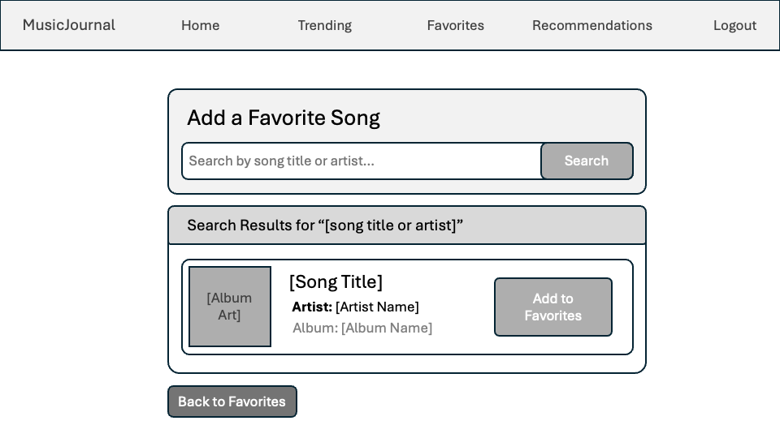
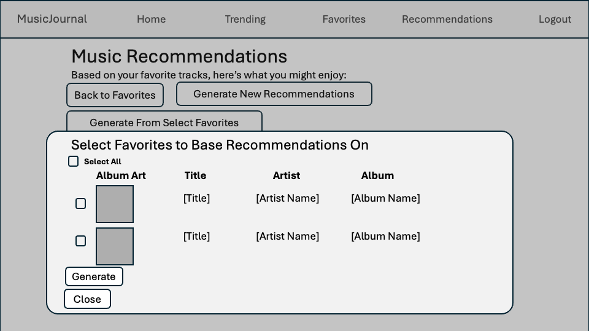
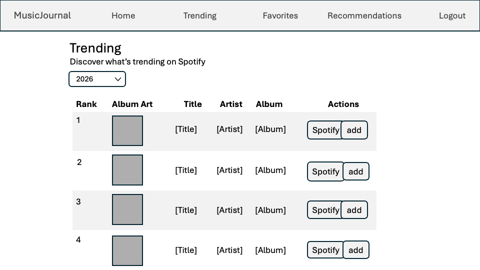

# MusicJournal UX Wireframes

These wireframes show the planned layout and interface structure for three of the main MusicJournal user workflows.

## Searching for and Adding a Favorite Song

This wireframe shows the interface for searching for a song and adding a selected track to the user's Favorites list.

## Generating Music Recommendations Based on Favorite Tracks

This wireframe shows the interface for generating music recommendations based on the user's saved favorite tracks, including the option to select specific favorites.

## Viewing Trending Songs by Year

This wireframe shows the interface for selecting a year, viewing trending tracks, and adding tracks to Favorites.

